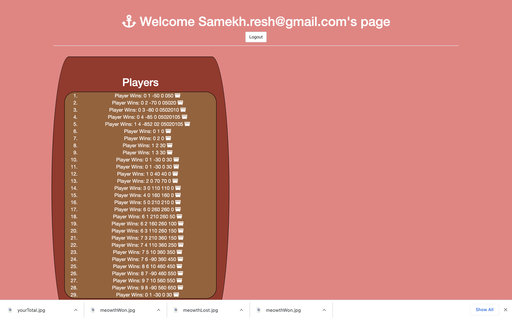
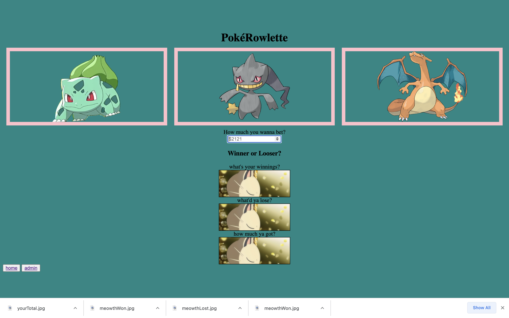

# Rowlette

**link to project**

### How It’s Made
Utilizing the express.js framework and some other node dependencies. 

<b>Langs used</b>
Using Express.js, Node.js, Javascript, HTML5, CSS3, and bootstrap

### optimizations
Optimizations. 
1. Make an actual roulette board
2. Function that randomly selects the spots on the game board in relation to whatever random number is picked. 
3. Css style changes. 

### Lessons Learned
You don’t need to target a specific element, when you can just do e.target
